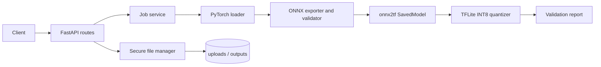

# PyTorch to TFLite Converter

A small FastAPI service for converting compatible PyTorch checkpoints through ONNX and TensorFlow SavedModel to fully INT8 TFLite.

## Features

- CPU-safe PyTorch checkpoint loading with explicit architecture selection
- ONNX structural validation and PyTorch-versus-ONNX numerical parity checks
- Deterministic NHWC representative data for post-conversion INT8 calibration
- Background jobs with progress, structured failures, downloadable artifacts, and JSON reports
- Configurable storage and upload limits through environment variables

## Architecture



## Pipeline

`checkpoint (.pth/.pt) -> PyTorch model -> ONNX -> ONNX Runtime parity check -> TensorFlow SavedModel -> fully INT8 TFLite`

The exporter uses NCHW input (`N,C,H,W`), and the TensorFlow quantizer supplies deterministic NHWC calibration samples. ONNX and TFLite conversion tools must support the model operators.

## Installation

Python 3.10 is recommended because the ML toolchain is large and version-sensitive.

```powershell
python -m venv .venv
.\.venv\Scripts\Activate.ps1
pip install -r requirements.txt
Copy-Item .env.example .env
```

Run the API:

```powershell
uvicorn app.main:app --reload
```

Open `http://127.0.0.1:8000/docs` for Swagger UI.

## API usage

Start a conversion:

```powershell
curl.exe -X POST "http://127.0.0.1:8000/convert?architecture=resnet18&input_shape=1,3,224,224" -F "model_file=@resnet18.pth"
```

Poll `/status/{job_id}`, then download `/download/{job_id}` and `/report/{job_id}` after completion. Uploads are limited by `MAX_UPLOAD_MB` and only `.pth` and `.pt` files are accepted.

## Supported models

The current allowlist is `resnet18`, `resnet34`, `resnet50`, `mobilenet_v2`, and `efficientnet_b0` from torchvision. A checkpoint must be either a serialized `torch.nn.Module`, or a state dictionary under `state_dict`, `model_state_dict`, or `model`, with weights matching the selected architecture. The service does not infer an unknown model architecture from arbitrary `.pth` files.

## Limitations

- Jobs are held in process memory and are lost when the process restarts; use a durable queue/database for production.
- Calibration samples are deterministic synthetic tensors, not representative production data. Accuracy-sensitive deployments should calibrate with domain data.
- Only single 4-D image inputs in NCHW form are currently supported.
- Unsupported ONNX operators, custom layers, dynamic non-batch dimensions, and multi-input models may fail conversion.
- Loading PyTorch files uses pickle semantics; never upload untrusted files to an exposed service.

## Testing

```powershell
pip install -r requirements-dev.txt
pytest -q
ruff check app tests
```

Tests use CPU-only deterministic fixtures and do not require internet, GPU, or the checked-in sample model.

## Project structure

```text
app/
  api/          FastAPI routes
  models/       API schemas
  services/     loading, export, validation, quantization, jobs, reports
  storage/      bounded upload and path handling
  config.py     environment-backed settings
  main.py       application entry point
tests/           unit and API tests
.github/         CI workflow
```

## Roadmap

Durable job storage and a queue worker, user-provided representative datasets, multi-input support, model metadata manifests, and deployment authentication/rate limiting.
